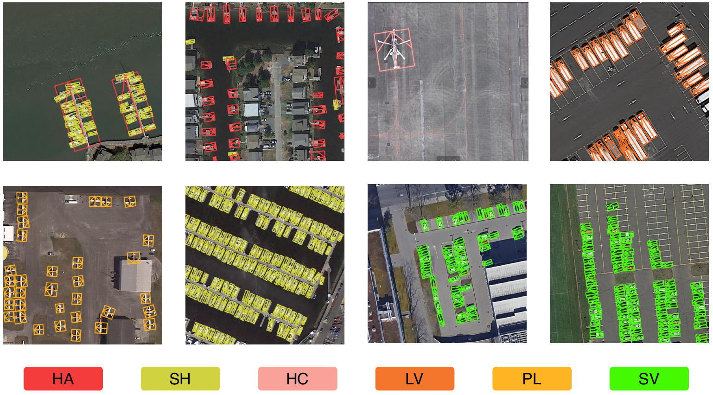

## YOLOv6-HDDet(for Object Heading Detection)



### Unimplemented Features
- Distillation
- `fuse_ab`
- `mosic` data augmentation

### Recommended Versions
- Python: 3.8
- CUDA: 11.8
- PyTorch: 2.0.1

### Dataset Format (*.txt)
```
class_num x y w h theta (0-360, clockwise rotation from true north)
0 0.08984375 0.486328125 0.19140625 0.1796875 270.0
```

### Box Conversion Functions Available
- For HBB, OBB, OHD:
  - `yolov6/utils/v5_rotation.py`

### Dataset Directory Structure
```
dataset/
├── images
│   ├── train
│   └── val
└── labels
    ├── train
    └── val

-> data/dataset.yaml
```

### Optional Configuration Files
- `./configs/ohd/yolov6n_finetune-ohd.py`
- `./configs/ohd/yolov6l_finetune-ohd.py`
- For more diverse and complex datasets (like DOTA or SJTU). It is recommended to use yolov6l and set flip, degree, translate and scale in data augmentation.
- For simple datasets (like HRSC2016 or my CAR dataset), yolov6n is recommended, and the recommended settings are translate, scale and shear.

### Trained Weights Download (CAR and SJTU-L)
- [Download Link(Google drive)](https://drive.google.com/drive/folders/1_iakNJbe37s-Z-vBHexrQ24DI19U415i?usp=sharing)

### Trained results.
| OHD-CAR     | mAP50 | Head_acc | Head_loss |
|-------------|-------|---------|-----------|
| v6n_HDDet   | 88.32 | 99.15   | 38.2      |
| v6n_FULLCSL | 76.94 | 99.81   | 11.88     |

| SJTU-L      | mAP50 | Head_acc | Head_loss |
|-------------|-------|----------|-----------|
| v6L_HDDet   | 66.81 | 66.75    | 38.62     |
| v6L_FULLCSL | 70.58 | 92.16    | 29.58     |

- HDDet is more suitable for lightweight models and small epochs training.FULLCSL on the other hand is suitable for complex datasets. And head_loss to be very low with HDDet. 


### Test Examples
```
python tools/infer_R.py --weights weights/SJTU-L/best_ckpt.pt --save-dir runs/infer/sjtu --source test_img/sjtu-l/

python tools/infer_R.py --weights weights/CAR/best_ckpt.pt --save-dir runs/infer/car --source test_img/car/
```

### Pretrained Weights for Training (Official)
- Uses a legacy version of the YOLOv6 pretrained model.
- Official pretrained models:
  - YOLOv6N: [Download](https://github.com/meituan/YOLOv6/releases/download/0.2.0/yolov6n.pt)
  - YOLOv6M: [Download](https://github.com/meituan/YOLOv6/releases/download/0.2.0/yolov6l.pt)

### Training Examples
```
python tools/train_R.py --write_trainbatch_tb --data-path "./data/sjtu.yaml" --conf-file "./configs/ohd/yolov6n_finetune-ohd.py" --batch-size 12 --workers 4 --epochs 300
```
## Credits
This project uses code from the following projects:
- [YOLOv6-R](https://github.com/haohaolalahao/YOLOv6-R) by [haohaolalahao](https://github.com/haohaolalahao)
- [YOLOv6](https://github.com/meituan/YOLOv6) by [meituan](https://github.com/meituan)
